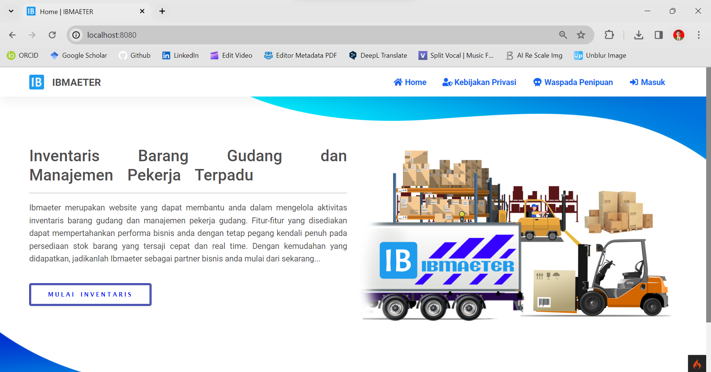
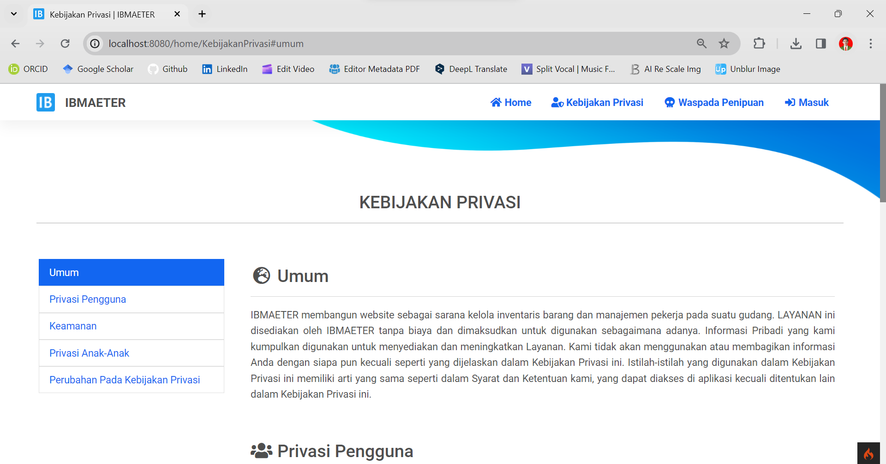
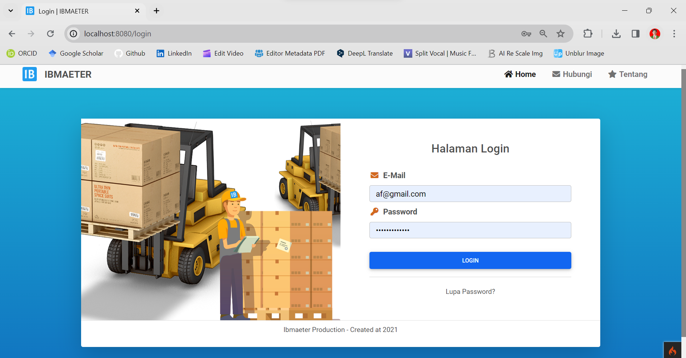
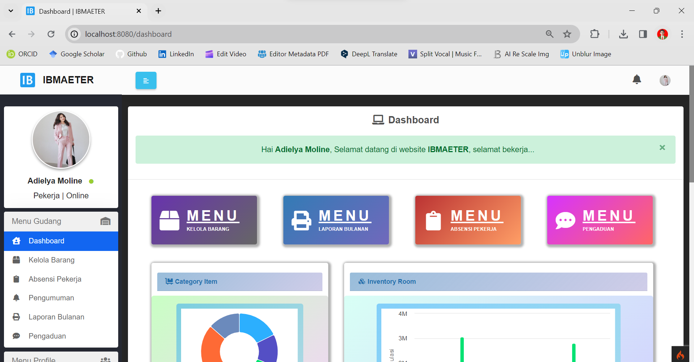
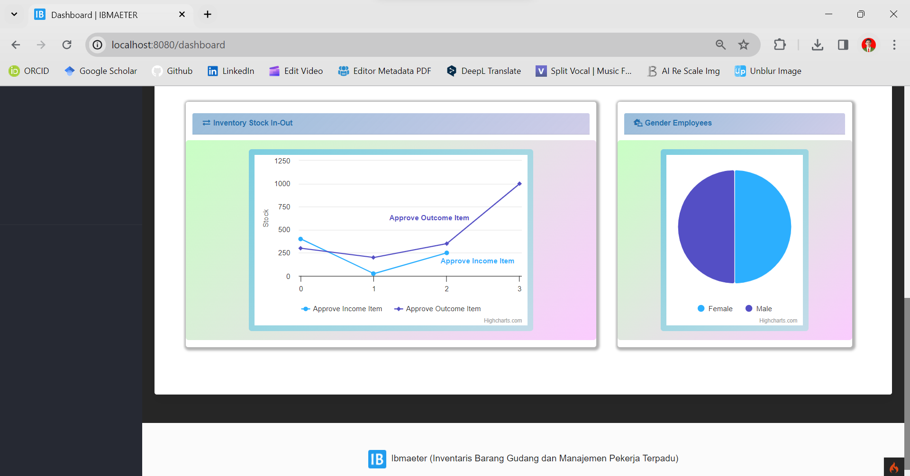
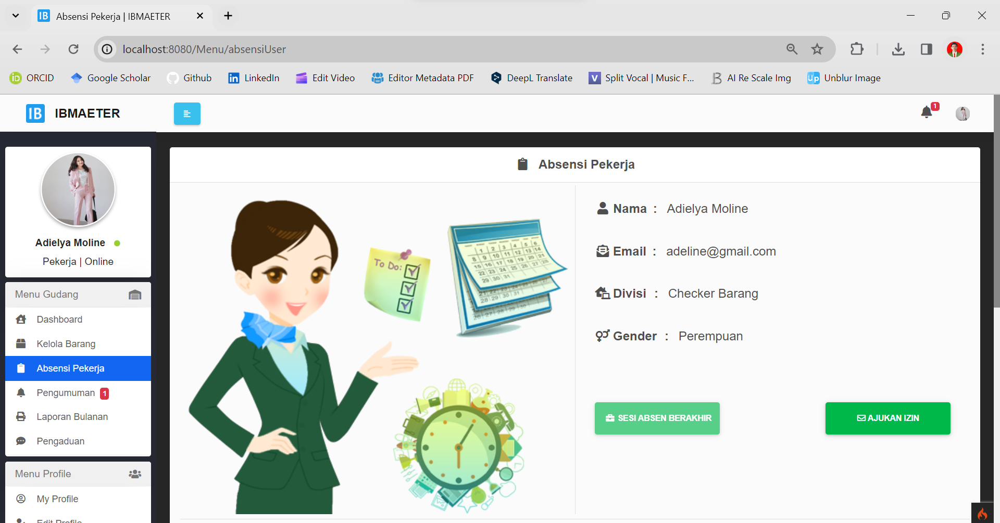
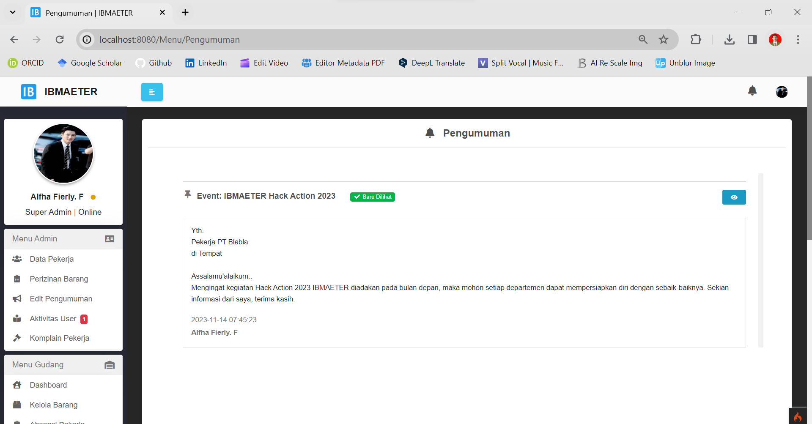

[](https://github.com/ellerbrock/open-source-badges/)
[](https://opensource.org/licenses/MIT)


# IBMAETER
<strong>Proyek HKI - Program Komputer</strong><br><br>
IBMAETER merupakan website yang memudahkan pengguna dalam mengelola kegiatan inventaris gudang dan manajemen pekerja gudang. Fitur-fitur yang disediakan dapat menjaga performa bisnis dengan tetap memegang kendali penuh atas stok persediaan barang, harga barang, berat barang, dan lainnya yang disajikan secara cepat dan real time, sehingga pengguna tidak perlu melakukan semua aktivitas secara manual. Pengguna juga diuntungkan dalam upaya penghematan waktu.

<br><br>

## Kebutuhan Proyek
| Bagian | Deskripsi |
| --- | --- |
| Fitur | Masuk, Buat, Baca, Ubah, Hapus, Paginasi, Pencarian, Validasi, Cetak, Ekspor, DLL |
| Kerangka Kerja | Bootstrap 4, CodeIgniter 4 |
| Peralatan | Visual Studio Code, XAMPP (PHP Versi 7.4), Git |

<br><br>

## Unduh & Instal
1. XAMPP dengan PHP versi 7.4

   <table><tr><td width="810">

   ```
   https://bit.ly/XAMPP_PHP7_Installer
   ```
   
   </td></tr></table><br>

2. Visual Studio Code

   <table><tr><td width="810">

   ```
   https://bit.ly/VScode_Installer
   ```
   
   </td></tr></table><br>

3. Git

   <table><tr><td width="810">
   
   ```
   https://bit.ly/GIT_Installer
   ```
   
   </td></tr></table>

<br><br>

## Basis data
1. Buka ``` XAMPP ```, lalu tekan tombol mulai di bagian ``` Apache ``` & ``` MySQL ```. Hal ini bertujuan untuk dapat mendukung website secara optimal.<br><br>

2. Akses ``` peramban ``` terlebih dahulu untuk membuka panel admin basis data, silakan salin tautan berikut: ``` localhost/phpmyadmin/ ```.<br><br>
   
3. Buat basis data bernama ``` warehouse_db ``` di lokal.<br><br>

4. Buka basis data ``` warehouse_db ``` dan Impor ``` warehouse_db_default.sql ``` di direktori ``` IBMAETER/public/sql ```.<br><br>

5. Jika basis data tidak berfungsi dengan baik, anda dapat mengimpor ``` trigger ``` yang disediakan oleh pembuat aplikasi di direktori ``` IBMAETER/public/sql/trigger ```.<br><br>

6. Kemudian buka berkas XAMPP: ``` php.ini ``` -> hapus ``` titik koma (;) ``` di depan ``` extension=intl ``` -> simpan.

<br><br>

## Akun Bawaan
| Peran | Surel | Kata Sandi |
| --- | --- | --- |
| Admin | af@gmail.com | Superadmin123 |
| User | adeline@gmail.com | User123456 |
| User | renaldyy@gmail.com | User123456 |

<br>

## Memulai
1. Unduh dan ekstrak repositori ini.<br><br>

2. Buka direktori ``` IBMAETER ```, lalu buka ``` GitBash ``` di dalam direktori tersebut.<br><br>
   
   • Pertama, periksa apakah ada masalah atau tidak, jika masih ada kesalahan, sesuaikan saja dengan situasinya.<br><br>
   
   • Kedua, langkah ini wajib dilakukan, jadi silakan salin perintah berikut ini:

   <table><tr><td width="810">
      
   ````bash
   php spark serve
   ````
   
   </td></tr></table><br>

3. Buka ``` peramban ``` anda (Tab baru), lalu ketik -> ``` localhost:8080 ``` atau sesuaikan dengan yang ada di ``` GitBash ``` anda.<br><br>
   
4. Silakan masuk dan akses fitur-fiturnya, selamat menikmati [Selesai].

<br><br>

## Sorotan
<table>
<tr>
<th width="280">Beranda</th>
<th width="280">Kebijakan</th>
<th width="280">Waspada Penipuan</th>
</tr>
<tr>
<td></td>
<td></td>
<td></td>
</tr>
</table>
<table>
<tr>
<th width="840">Masuk</th>
</tr>
<tr>
<td></td>
</tr>
</table>
<table>
<tr>
<th colspan="2">Dasbor</th>
</tr>
<tr>
<td width="420"></td>
<td width="420"></td>
</tr>
</table>
<table>
<tr>
<th width="280">Tambah Pekerja</th>
<th width="280">Ubah Pekerja</th>
<th width="280">Otorisasi Barang</th>
</tr>
<tr>
<td></td>
<td></td>
<td></td>
</tr>
</table>
<table>
<tr>
<th width="280">Kelola Barang</th>
<th width="280">Fitur Cetak</th>
<th width="280">Absensi</th>
</tr>
<tr>
<td></td>
<td></td>
<td></td>
</tr>
</table>
<table>
<tr>
<th width="280">Rekam Jejak Pengguna</th>
<th width="280">Ubah Profil</th>
<th width="280">Pengumuman</th>
</tr>
<tr>
<td></td>
<td></td>
<td></td>
</tr>
</table>
<table>
<tr>
<th width="840">Ubah Pengumuman</th>
</tr>
<tr>
<td></td>
</tr>
</table>

<br><br>

## Anggota Tim Proyek IBMAETER
| ANGGOTA | NAMA LENGKAP |
| --- | --- |
| 1 | Rizky Parlika, S.Kom., M.Kom. |
| 2 | Rifky Akhmad Fernanda, S.Kom. |
| 3 | Devan Cakra Mudra Wijaya, S.Kom. |
| 4 | Merdin Risalul Abrori, S.Kom. |
| 5 | Arista Pratama, S.Kom., M.Kom. |
| 6 | Lugito Michael Imanuel Prasetya, S.Kom. |

<br><br>

## Pengingat
Jika penambahan otomatis basis data masih belum beres, maka anda dapat melakukan hal berikut ini di phpMyAdmin:

<table><tr><td width="840">
   
```sql
SET  @num := 0;
UPDATE your_table SET id = @num := (@num+1);
ALTER TABLE your_table AUTO_INCREMENT =1;
```

</td></tr></table>

<br><br>

## Apresiasi
Jika karya ini bermanfaat bagi anda, maka dukunglah karya ini sebagai bentuk apresiasi kepada penulis dengan mengklik tombol ``` ⭐Bintang ``` di bagian atas repositori.

<br><br>

## Penafian
Aplikasi ini merupakan hasil karya saya bersama tim saya dan bukan merupakan hasil plagiat dari penelitian atau karya orang lain, kecuali yang berkaitan dengan layanan pihak ketiga yang meliputi: pustaka, kerangka kerja, dan lain sebagainya.

<br><br>

## LISENSI
LISENSI 3 KLAUSUL BSD - Hak Cipta © 2023 - Devan C. M. Wijaya dkk

Penyebarluasan dan penggunaan dalam bentuk sumber dan biner, dengan atau tanpa dengan atau tanpa modifikasi, diperbolehkan asalkan memenuhi persyaratan berikut:

1. Redistribusi kode sumber harus mempertahankan pemberitahuan hak cipta di atas, daftar ketentuan ini dan penafian berikut.

2. Redistribusi dalam bentuk biner harus mereproduksi pemberitahuan hak cipta di atas, daftar ketentuan ini dan penafian berikut dalam dokumentasi, dan/atau materi lain yang disertakan dengan distribusi.

3. Baik nama pemegang hak cipta maupun nama kontributornya tidak boleh digunakan untuk mendukung atau mempromosikan produk yang berasal dari perangkat lunak ini tanpa izin tertulis sebelumnya.

PERANGKAT LUNAK INI DISEDIAKAN OLEH PEMEGANG HAK CIPTA DAN KONTRIBUTOR "SEBAGAIMANA ADANYA" DAN SEGALA JAMINAN TERSURAT MAUPUN TERSIRAT, TERMASUK, NAMUN TIDAK TERBATAS PADA JAMINAN TERSIRAT ATAS KELAYAKAN UNTUK DIPERDAGANGKAN DAN KESESUAIAN UNTUK TUJUAN TERTENTU DITIADAKAN. PEMEGANG HAK CIPTA ATAU KONTRIBUTOR TIDAK BERTANGGUNG JAWAB ATAS KERUSAKAN LANGSUNG, TIDAK LANGSUNG, INSIDENTAL, KHUSUS, CONTOH, ATAU KONSEKUENSIAL (TERMASUK NAMUN TIDAK TERBATAS PADA PENGADAAN BARANG ATAU JASA PENGGANTI; KEHILANGAN PENGGUNAAN, DATA, ATAU KEUNTUNGAN; ATAU GANGGUAN BISNIS) BAGAIMANAPUN PENYEBABNYA DAN BERDASARKAN TEORI PERTANGGUNGJAWABAN APA PUN, BAIK DALAM KONTRAK, PERTANGGUNGJAWABAN YANG KETAT, ATAU KESALAHAN (TERMASUK KELALAIAN ATAU LAINNYA) YANG TIMBUL DENGAN CARA APA PUN DARI PENGGUNAAN PERANGKAT LUNAK INI, MESKIPUN TELAH DIBERITAHUKAN TENTANG KEMUNGKINAN KERUSAKAN TERSEBUT.
